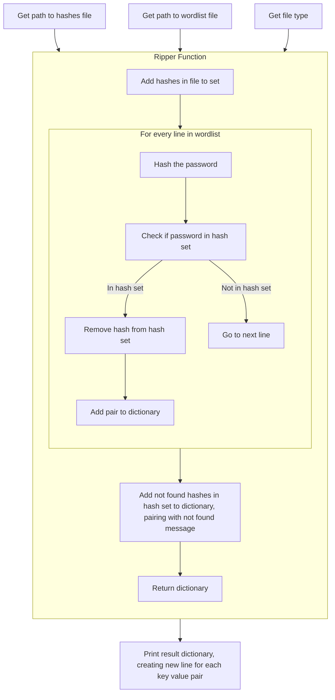

# Dylan Soule's Hexorcist

The jane the ripper python script will attempt to crack the hashes in a hash list you provide, and compare it against all the possible passwords in the wordlist you provide.  
The script runs in the terminal and allows you to provide paths to the hash and wordlist files, as well as the hashing algorithm that the hash file used

## Requirements
* Python 3
* Does not require any external libraries however the built in python hashlib library is used.

## Installation
* Download the [jane_the_ripper.py](./jane_the_ripper.py) file  
* Import the file into a code running software such as vscode or you can run in the terminal  
* Run the file

## How to Use
Begin by running the file, run the command below in your terminal if you are doing it there
```bash
cd [file path to jane_the_ripper.py] | python3 jane_the_ripper.py
```
After running the file you will be prompted to specify the path to the hashes and wordlist files, you can either enter the absolute or the relative path to the file. You will also be asked what hashing algorithm you like like to use(ex. md5, sha256)  
The program will then compare all the wordlist options to all the hashes to see if any match  

### Creating Your Lists
When making your hashes and wordlist files make sure they have one entry on each lines, ex:  

**hashes.txt:**
```
a53f3929621dba1306f8a61588f52f55
e99a18c428cb38d5f260853678922e03
40be4e59b9a2a2b5dffb918c0e86b3d7
c33367701511b4f6020ec61ded352059
etc...
```
**wordlist.txt**
```
password
123456
12345678
qwerty
abc123
etc...
```

### Code Highlight
Jane the Ripper allows for use of any hashing algorithm in hashlib such as md5 or sha256
```python
with open(wordlist_path, 'r') as passwords:
    for line in passwords:
        hasher = hashlib.new(hash_type)
        hasher.update(line.strip('\n').encode())
        encoded_line = hasher.hexdigest()
        if encoded_line in hash_set:
            cracked[encoded_line] = line.strip('\n')
            hash_set.remove(encoded_line)
```
By making a hasher object you can input a hash_type into the function

## Program Flow
* The program works according to the chart below


## Testing
**The file can be tested using pytest**

In order to test the file, first make sure you have installed both the [jane_the_ripper.py](./jane_the ripper.py) and the [test_jane_the_ripper.py](./test_jane_the_ripper.py) files, and they are both in the same directory.  
You also need to have the [hashes.txt](./Testing%20Files/hashes.txt) and the [wordlist.txt](./Testing%20Files/wordlist.txt) files in that same directory for the tests to run correctly
Then in order to test the file, run the following commands in your terminal
```bash
cd [path to directory file is located]
pytest test_jane_the_ripper.py
```